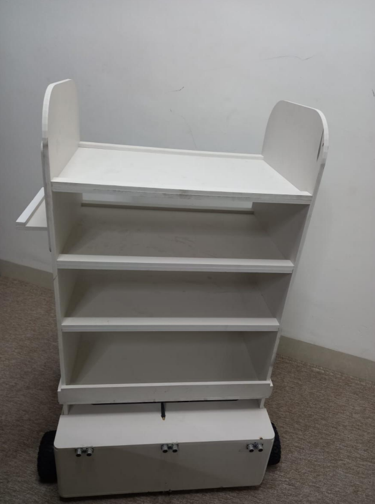
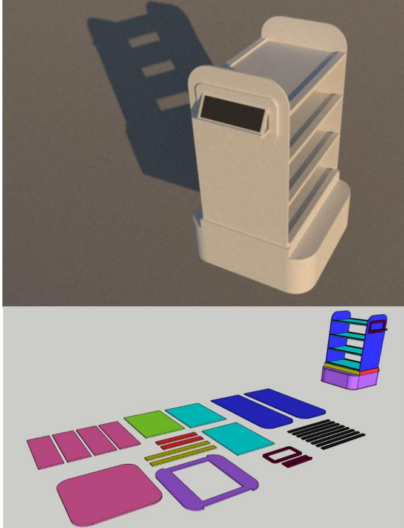

<div align="center">

# 🤖 AVIV — Autonomous Waiter Robot

**A full-stack, low-cost autonomous waiter robot that delivers food in restaurants for ~1% of the cost of commercial systems.**

[](docs/HARDWARE.md)
[](docs/ALGORITHMS.md)
[](firmware/)
[](src/)
[](LICENSE)

*B.Sc. Computer Engineering graduation project — Komar University of Science and Technology*

&nbsp;&nbsp;

</div>

---

## 💡 What is AVIV?

AVIV is an **autonomous waiter robot** that carries meals from the kitchen to restaurant tables on its own. Customers order from their phone by scanning a QR code, the kitchen loads the food onto the robot, and AVIV navigates to the table, avoids people and obstacles on the way, serves, and returns to base — no waiter required for the delivery run.

Commercial restaurant robots (BellaBot, BETA-G) cost **$15,000–$40,000** because they rely on LiDAR and SLAM. AVIV reaches the same goal using **line-following with IR markers** on an **$8 ESP32**, bringing the entire build down to **~$287** — a **40–83× cost reduction** that puts restaurant automation within reach of small cafés and developing regions.

> Built as a complete engineering system: custom hardware, embedded control algorithms, and a real web application — evolved across **four prototype iterations (FV1 → FV4)**.

---

## ✨ Highlights

| | |
|---|---|
| 💵 **~$287 total hardware** | vs. $8k–$40k for commercial robots (see the [cost comparison](#-how-aviv-compares)) |
| 🧠 **Runs on a single ESP32** | 240 MHz, Wi-Fi built in — no PC, no LiDAR, no cloud |
| 🛤️ **Line-following navigation** | Predictable, transparent paths customers can see and trust |
| 📦 **30 kg payload, 4 shelves** | CNC laser-cut body serves multiple tables in one trip |
| 🥤 **Zero spills** | Jerk-limited **S-curve motion** — 0 spills across 50 test deliveries |
| 🎯 **98% navigation success** | ±6 cm path accuracy, 100% obstacle detection |
| 📱 **Full web control system** | QR ordering, staff dashboard, admin analytics — real-time, multi-device |
| 🔁 **Bidirectional, no turns** | Forward/backward line following avoids fragile 180° pivots |

---

## 🏗️ System Architecture

AVIV is a three-tier system: customers and staff interact through a web app, a local server holds the source of truth, and the ESP32 brain drives the robot.

```
        ┌──────────────┐   ┌──────────────┐   ┌──────────────┐
        │  Customer 📱  │   │   Staff 🧑‍🍳   │   │   Admin 📊    │
        │  (QR menu)   │   │  (dashboard) │   │  (reports)   │
        └──────┬───────┘   └──────┬───────┘   └──────┬───────┘
               │                  │                  │
               └──────────────────┼──────────────────┘
                                  │  HTTP / REST (local Wi-Fi, mDNS)
                          ┌───────▼────────┐
                          │  Node + Express │
                          │  + SQLite store │   ← orders, users, status
                          └───────┬────────┘
                                  │  polls "paid" orders
                          ┌───────▼────────┐
                          │   ESP32 (brain) │
                          │  PID · S-curve  │
                          │  state machine  │
                          └───────┬────────┘
            ┌──────────────┬──────┴───────┬───────────────┐
        8× IR sensors  6× ultrasonic  4× encoders   2× BTS7960 → 4× DC motors
       (line + markers) (obstacles)  (closed loop)        (drive)
```

📖 **Deep dives:** [System & Web Architecture](docs/ARCHITECTURE.md) · [Hardware & BOM](docs/HARDWARE.md) · [Control Algorithms](docs/ALGORITHMS.md) · [Firmware guide](firmware/README.md)

---

## 🧠 How it works

1. **Order** — Each table has a QR code locked to its table number. The customer scans it, browses the menu, and places an order.
2. **Confirm** — The order appears on the **staff dashboard**. The cashier marks it paid; the kitchen loads the food and presses **"Launch AVIV"**.
3. **Navigate** — The ESP32 follows a line on the floor, counting **IR markers** to know which table it's passing. A custom **5-step serving algorithm** plans the most efficient multi-table route.
4. **Serve safely** — **PID control** keeps AVIV centered on the line; an **S-curve motion profile** ramps speed smoothly so drinks never spill. Ultrasonic sensors stop the robot if a person steps in the way.
5. **Return** — After the last delivery, AVIV drives itself back to the staff station and waits for the next run.

---

## 📊 How AVIV compares

| Criterion | BETA-G (academic) | BellaBot (commercial) | **AVIV** |
|---|---|---|---|
| Navigation | SLAM (LiDAR) | SLAM (LiDAR + depth) | **Line-following + markers** |
| Processing | Intel NUC + ROS | Embedded ARM + Linux | **ESP32 @ 240 MHz** |
| Sensors | LiDAR, IMU | LiDAR, depth cam, ultrasonic | **8× IR, 6× ultrasonic, 4× encoders** |
| Payload | Not documented | 15 kg | **30 kg** |
| Hardware cost | $8,000–$12,000 | $15,000–$25,000 | **$287** |
| 3-year total cost | ~$10,000 | $30,000–$40,000 | **$287** |
| Navigation success | 87% | ~95% | **98%** |
| Setup | Hours (mapping) | 2–3 days | **Minutes** |

*Full analysis and references in [docs/HARDWARE.md](docs/HARDWARE.md).*

---

## 🔩 Hardware at a glance

- **Brain:** ESP32 DevKit V4 (240 MHz, Wi-Fi) + 38-pin expansion shield
- **Drive:** 4× JGB37-555 12 V high-torque gear motors · 2× BTS7960 (43 A) drivers · 130 mm all-terrain wheels
- **Sensing:** 8× IR line/marker sensors · 6× HC-SR04 ultrasonic · 4× HC-020K wheel encoders
- **Power:** 12 V 17 Ah sealed battery
- **Body:** CNC laser-cut foam board, 60 × 60 cm, ~10 kg, 4 internal shelves, 11" tablet mount, **30 kg capacity**
- **Interface:** Wall-/robot-mounted tablet running the web app

→ Complete bill of materials, specs, and selection rationale: **[docs/HARDWARE.md](docs/HARDWARE.md)**

---

## 🧮 Control algorithms

| Algorithm | Purpose | Result |
|---|---|---|
| **PID line following** | Keep the robot centered on the line (front + back arrays) | ±6 cm tracking |
| **S-curve motion profile** | Jerk-limited acceleration to protect the payload | 0 spills / 50 deliveries |
| **Table-serving (5-step)** | Plan multi-table delivery order on a looped track | No zig-zag, shortest path |

The serving planner uses **directional grouping + a 5-forward / 4-backward rule** on a ring-shaped track to minimize travel. → **[docs/ALGORITHMS.md](docs/ALGORITHMS.md)**

---

## 💻 The Web Control System

A modern, real-time ordering app that ties customers, staff, and the robot together over local Wi-Fi.

**Tech stack:** React · TypeScript · Vite · Tailwind CSS · shadcn/ui · Node.js · Express · SQLite

**Roles**
- 👤 **Customer** — scan QR → browse menu → order (table number locked)
- 🧑‍🍳 **Staff** — cashier view (manual orders, mark paid) + kitchen view (load robot, launch)
- 📊 **Admin** — analytics, revenue, most-ordered items, user management, database maintenance

### Getting started

> Requirements: Node.js 16+ and npm. All devices must share one local Wi-Fi network.

```bash
# 1. Install web app + backend dependencies
npm install
cd server && npm install && cd ..

# 2. Start the backend API (port 3001) — creates the SQLite DB on first run
cd server && npm start
#    ...and in a second terminal, start the web app (port 8080)
npm run dev
```

Open `http://<your-computer-ip>:8080` from any device on the network:

| Page | URL |
|---|---|
| Customer menu | `http://<ip>:8080` |
| Staff dashboard | `http://<ip>:8080/staff/login` |
| Admin panel | `http://<ip>:8080/admin/login` |

Default demo admin login: `admin` / `admin123` — **change this before any real deployment.**

API host/port can be overridden with environment variables — see [`.env.example`](.env.example).

---

## 🛰️ Firmware (ESP32)

All embedded code lives in [`firmware/`](firmware/), organized by function:

```
firmware/
├── navigation/    Line following (fwd/bwd), table navigation, IMU experiments, Python simulator
├── camera-qr/     FV1 ESP32-CAM QR experiments
├── notification/  Web → ESP32 table-notification receiver
└── prototypes/    Early motor/sensor test sketches
```

Flash the `.ino` files with the Arduino IDE (set your Wi-Fi SSID/password at the top of each sketch). Full mapping and per-file notes: **[firmware/README.md](firmware/README.md)**

---

## 🧪 Prototype evolution (FV1 → FV4)

This robot wasn't built in one shot — it took four iterations, each fixing the last one's failures:

| Version | Big idea | Why it changed |
|---|---|---|
| **FV1** | ESP32-CAM scans QR codes at each table | Camera too slow to keep up with the robot ❌ |
| **FV2** | IR marker counting + PID + S-curve | Reliable line following, but weak prototype motors |
| **FV3** | IMU-based emergency escape maneuvers | Motor EMI wrecked the gyroscope ❌ |
| **FV4** | Linear-only nav, encoders, high-torque drive | **Production-ready: 98% success** ✅ |

The full story — including every problem, root cause, and lesson — is in [docs/ALGORITHMS.md](docs/ALGORITHMS.md#prototype-evolution).

---

## 🚀 Future work

- Swap the sealed lead-acid battery for **lithium** (longer life, lighter)
- Add **LiDAR** for 360° detection and richer path planning
- Tighter obstacle-recovery behavior for busier floors

---

## 👥 Authors

Graduation project, **Department of Computer Engineering, Komar University of Science and Technology**.

- **Hozan Aso Ibrahim**
- **Mirko Awat Mahmood**
- **Yad Azad Nassrat**

*Academic advisor: Asst. Prof. Dr. Shwan Abdullah · Chairperson: Dr. Susan Al Naqshbandi · Submitted December 2025.*

---

## 📄 License

Released under the [MIT License](LICENSE) — free to use, study, and build on. If AVIV helps your project, a star ⭐ or a citation is appreciated.
